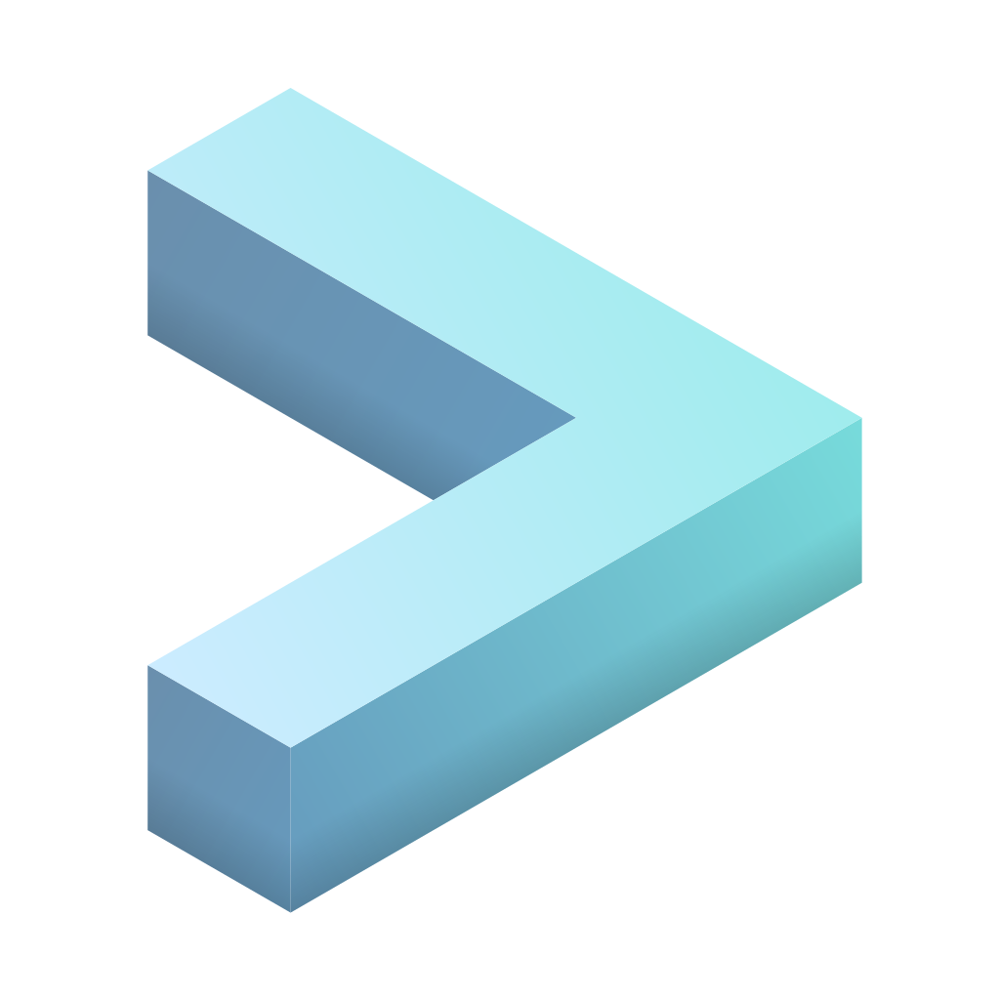

## Hi I'm Cookiesource 

- 🔭 I’m currently working on [AerynOS](https://aerynos.com/)
- 🌍 I speak English/Dutch & learning JP/ES
- 📫 How to reach me: Discord: CookieSource
- 🏳️‍🌈 Pronouns: Cookie/Her
- ⚡ Fun fact: I'm a cookie from another planet that lives among the humans

  
<b>👤&nbsp;&nbsp;About Me</b>

I'm an IT System administrator.

You can best describe me as someone who is always looking for the latest technology and developments.
  
  

  
<b>🕑 Projects</b>

     

**AerynOS** 
I actively contribute to AerynOS by maintaining packages, implementing fixes, writing documentation, and being deeply involved across all aspects of the project.

**RebornOS** 
Old RebornOS Project leader RebornOS is an Arch based Linux distribution with a team of developers, artists and other talented individuals aiming to make Arch Linux as user friendly as possible by providing interface solutions to things you normally have to do in a terminal.  

**Wiki** 
I'm an ex Wiki pro contributor and have contributed to several other gaming and technical wikis  

 

  
<b>🙠Hobbies </b>

  
- Singing /  Music
- Anime
- Coding / Programming
- Table tennis
- Swimming
- Server stuff
- Tinkering & Automation

  

<h2 align="left">Technology I use</h2> 

> Tools, languages, and other things that I use!

<table>
  <tr>
    <td align="center" width="96">
      
       Laptop
    </td>
    <td align="center" width="96">
      
       VSCode
    </td>
    <td align="center" width="96">
      
       KDE
    </td>
    <td align="center" width="96">
      
       KDE Plasma
    </td>
    <td align="center" width="96">
      
       AerynOS
    </td>
    <td align="center" width="96">
      
       Hugo
    </td>
    <td align="center" width="96">
      
       Dark Reader
    </td>
    <td align="center" width="96">
      
       Salt
    </td>
    <td align="center" width="96">
      
       Tabby
    </td>
  </tr>
  <tr>
    <td align="center" width="96"> 
      
       HTML/CSS
    </td>
    <td align="center" width="96">
      
       Debian
    </td>
    <td align="center"  width="96">
      
       Cloud servers
    </td>
    <td align="center"  width="96">
      
       Fish
    </td>
    <td align="center" width="96">
      
       Astro Starlight
    </td>
    <td align="center"  width="96">
      
       Ansible
    </td>
    <td align="center" width="96">
      
       Openscap
    </td>
    <td align="center" width="96">
      
       PowerShell
    </td>
    <td align="center" width="96">
      
       Uyuni
    </td>
  </tr>
</table>

